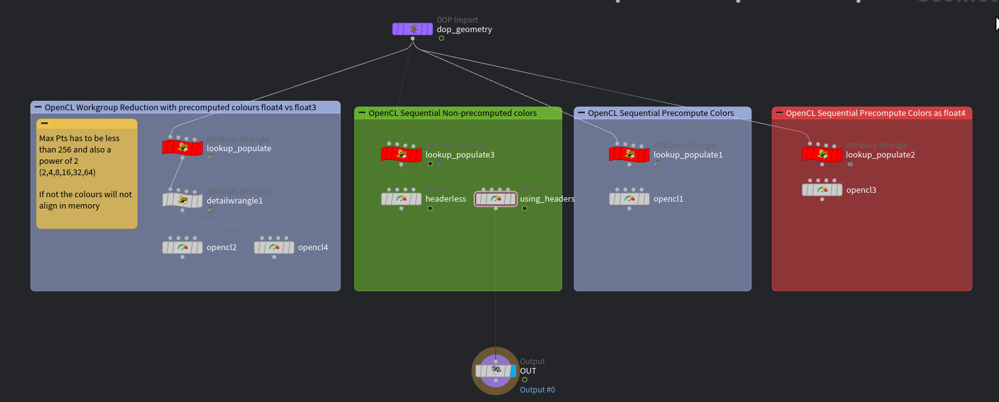

# Mixbox Pigment Colour Mixing in Houdini OpenCL

[MixBox](https://github.com/scrtwpns/mixbox/tree/master) is a colour mixing method created by [@scrtwpns](https://github.com/scrtwpns) to model realistic pigment mixing.
</br>
My objective was to port the code to a OpenCL kernel to run in Houdini to use in fluid simulations and image processing.

https://github.com/user-attachments/assets/eb13e046-8726-4011-834d-08590bc8c582

## [Demo HIP](houdini_mixbox_demo.hiplc)

Demo file was saved in Houdini 22, however the code and package should work on Houdini 20+</br>
Contains a FLIP setup and a COPs setup. The FLIP setup is implemented as a sop solver inside the flip dopnet. The sop solver is required to be after the sourcing, or else the proximity search will not be accurate.</br></br>
</br>
The SOP solver setup also contains a few different variations where I tried to optimize the kernel using Workgroup Reduction, but the fastest method I have tried by far is the code I've set as the example below.</br>The same example is the node stream that is connected in the demo HIP.</br>
In this screenshot, green is the fastest, blue is medium and tied while red is the slowest.

## Installing the package

Download or git clone this repository into your Documents/houdinixx.x/packages folder.</br>
Then move mixbox-houdini-opencl.json up into the packages folder.

## Using the Library

### Declarations

```c
const uchar LUT[799075]; //Look-up table for evaluating polynomials
float4 mixbox_eval_polynomial(const float4 c);

struct mixbox_latent;
mixbox_latent add_latent(mixbox_latent a, mixbox_latent b);
mixbox_latent subtract_latent(mixbo_latent a, mixbox_latent b);
mixbox_latent multiply_latent(mixbo_latent a, float b);
mixbox_latent divide_latent(mixbo_latent a, float b);

mixbox_latent mixbox_rgb_to_latent(float4 rgba, const global uchar * restrict LUT);
float4 mixbox_latent_to_rgb(mixbox_latent latent);


static float3 mixbox_lerp(float3 basecolor, float3 mixcolor, float mix, const global uchar * restrict LUT);

//Utility Colour functions
#define __LINEAR_GAMMA // <-- Define this if your input colour is linear gamma
float mixbox_linear_to_srgbf(float x);
float mixbox_srgb_to_linearf(float x);
float4 mixbox_linear_to_srgb(float4 rgb);
float4 mixbox_srgb_to_linear(float4 rgb);

```

All of the colour functions expect a float4, however no processing happens to the 4th element.</br>
I did it this way because I assumed it might make it faster since the GPU loads memory into 128bit registers, however I think it makes no difference here.

### SOP: Blending points with a uniform kernel:

Before the OpenCL SOP, you need the following 4 attributes:

```c
v@Cd         //Point Colour
i[]@querypts //Array of nearpoints that will get blended
i@iter       //Length of @querypts
v@__tmpCd    //A temporary vector attribute to store intermediate results
```

```c
#bind point &Cd float3
#bind point querypts int[]
#bind point iter int
#bind point &__tmpCd float3

//#define __LINEAR_GAMMA
//Uncomment the line above if your input Cd is in linear gamma

#import "mixbox.h"

@KERNEL
{
    float4 first_color = (float4)(@Cd.getAt(@querypts[0]),1.0f);
    mixbox_latent sum_latent = mixbox_rgb_to_latent(first_color,LUT);

    #pragma unroll
    for(int i = 1; i < @iter; i++){
        float4 rgba = (float4)(@Cd.getAt(@querypts[i]),1.0f);
        mixbox_latent t_latent = mixbox_rgb_to_latent(rgba, LUT);
        sum_latent = add_latent(sum_latent,t_latent);
    }

    float4 resultcolor = mixbox_latent_to_rgb(divide_latent(sum_latent,@iter));
    float3 rgb = (float3)(resultcolor.x,resultcolor.y,resultcolor.z);
    @__tmpCd.set(rgb);
}
@WRITEBACK
{
    @Cd.set(@__tmpCd);
}
```

Alternatively, instead of `#import "mixbox.h"`, you can copy and paste in the entire [header file](ocl/include/mixbox.h) in place if you don't want to install this package.

### COP: Blending pixels with a weighted kernel:

```c
#bind layer src? val=0
#bind parm kernel_size int val=2
#bind layer !&dst

//#define __LINEAR_GAMMA
//Uncomment the line above if your input Cd is in linear gamma

#import "mixbox.h"


@KERNEL
{
    int ix = @ix;
    int iy = @iy;
    int width = @src.xres;
    int height = @src.yres;
    int kernelsz = @kernel_size;
    mixbox_latent sum_latent = (mixbox_latent){0};

    float sigma = max(0.5f, (float)kernelsz / 2.0f);
    float two_sigma_sq = 2.0f * sigma * sigma;
    float total_weight = 0.0f;

    for (int dy = -kernelsz; dy <=kernelsz; dy++) {
        for (int dx = -kernelsz; dx <= kernelsz; dx++) {
            int x = ix + dx;
            int y = iy + dy;

            if (x >= 0 && x < width && y >= 0 && y < height) {
                float dist_sq = (float)(dx * dx + dy * dy);
                float weight = exp(-dist_sq / two_sigma_sq);

                float2 uv = @src.bufferToImage((float2)(x,y));
                float4 rgb = (float4)(@src.imageSample(uv));
                mixbox_latent c_latent = multiply_latent(mixbox_rgb_to_latent(rgb,LUT),weight);
                sum_latent = add_latent(sum_latent,c_latent);
                total_weight += weight;
            }
        }
    }

    sum_latent = divide_latent(sum_latent,total_weight);
    float4 result_color = mixbox_latent_to_rgb(sum_latent);

    @dst.set(result_color);
}
```

Same as the SOP code, instead of `#import "mixbox.h"`, you can copy and paste in the entire [header file](ocl/include/mixbox.h) in place if you don't want to install this package.

## Credits and License

This project is not affiliated with Secret Weapons who developed and have the rights to the MixBox algorithm.

Copyright (c) 2022, Secret Weapons. All rights reserved. </br>
Mixbox is provided under the CC BY-NC 4.0 license for non-commercial use only.</br>
If you want to obtain commercial license, please contact: mixbox@scrtwpns.com
